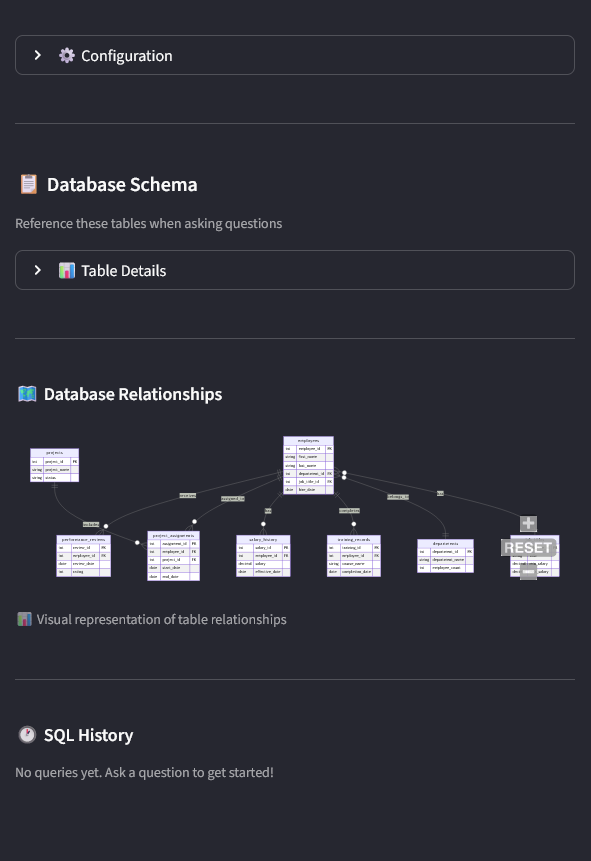

# TechCorp HR Analytics — Text-to-SQL Engine
 
An AI-powered HR analytics application that converts plain English questions into SQL queries, executes them against a real database, and returns results with automatic visualizations and business insights — no SQL knowledge required.
 
Built with Python, Streamlit, SQLite, and dual AI provider support (Anthropic Claude + Google Gemini).
 
---
 
## What It Does
 
```
Plain English Question  →  AI generates SQL  →  Safety Validator  →  Execute against SQLite  →  Results + Chart + Insight
"Who are the top 5        SELECT e.first_name,    Blocks DROP,          Runs safely against       Table, visualization,
 highest paid             e.last_name, e.salary   DELETE, UPDATE,       in-memory HR database     and business insight
 employees?"              FROM employees           injection attempts                              generated automatically
                          ORDER BY salary DESC
                          LIMIT 5;
```
 
---
 
## Features
 
- **Natural Language to SQL** — Ask questions in plain English, get back SQL and results instantly
- **Dual AI Provider Support** — Switch between Claude (Anthropic) and Gemini (Google) with a single dropdown; Gemini free tier supported
- **Auto-Visualization** — AI generates appropriate matplotlib/seaborn charts for every query result
- **Business Insights** — Claude automatically interprets results and surfaces actionable recommendations
- **Conversation Memory** — Follow-up questions reference previous queries ("show me just the top 3")
- **SQL History Sidebar** — Every query logged with timestamp and one-click re-run
- **Custom SQL Tab** — Power users can write and execute their own SQL with full safety validation
- **CSV Export** — Download any result set with a single click, persists across the session
- **SQL Safety Validator** — Blocks dangerous operations (DROP, DELETE, UPDATE, injection attempts) before execution
- **ER Diagram** — Interactive Mermaid entity-relationship diagram rendered in the sidebar
 
---
 
## Tech Stack
 
| Layer | Technology |
|-------|-----------|
| Frontend | Streamlit |
| AI — Primary | Anthropic Claude (claude-sonnet-4) |
| AI — Free Tier | Google Gemini (gemini-2.5-flash) |
| Database | SQLite (in-memory) |
| Data Processing | pandas, NumPy |
| Visualization | matplotlib, seaborn |
| Environment | python-dotenv |
| ER Diagram | streamlit-mermaid |
 
---
 
## The Database
 
TechCorp HR database — 8 tables, 1,300+ rows of realistic HR data.
 
| Table | Rows | Description |
|-------|------|-------------|
| `employees` | 120 | Employee records, salary, work mode, status |
| `departments` | 8 | Organizational units with budgets |
| `job_titles` | 38 | Roles with salary bands and career levels |
| `salary_history` | 308 | Every salary change with date and reason |
| `projects` | 20 | Company projects with budgets and status |
| `project_assignments` | 138 | Many-to-many: employees ↔ projects |
| `performance_reviews` | 293 | Annual ratings 2022–2024 |
| `training_records` | 418 | Course enrollments and completions |
 
---
 
## Project Structure
 
```
text2sql-hr-analytics/
├── text2sql_app.py          ← Streamlit web application
├── text2sql_engine.py       ← Core Text-to-SQL pipeline engine
├── db_utils.py              ← Database loading and schema utilities
├── requirements.txt         ← Project dependencies
├── .env                     ← API keys (not committed)
├── .gitignore
│
├── data/                    ← HR database CSV files (8 files)
│   ├── employees.csv
│   ├── departments.csv
│   ├── job_titles.csv
│   ├── salary_history.csv
│   ├── projects.csv
│   ├── project_assignments.csv
│   ├── performance_reviews.csv
│   └── training_records.csv
│
└── schema/                  ← Database documentation
    ├── SCHEMA.md
    └── er_diagram.mermaid
```
 
---
 
## Getting Started
 
### 1. Clone the Repository
 
```bash
git clone https://github.com/Drizztovski/text2sql-hr-analytics.git
cd text2sql-hr-analytics
```
 
### 2. Install Dependencies
 
```bash
pip install -r requirements.txt
```
 
### 3. Configure API Keys
 
Create a `.env` file in the project root:
 
```env
ANTHROPIC_API_KEY=your_claude_api_key_here
```
 
For Gemini (free tier), you can enter the key directly in the app UI — no `.env` entry required.
 
Get API keys:
- Claude: [console.anthropic.com](https://console.anthropic.com/settings/keys)
- Gemini: [aistudio.google.com/apikey](https://aistudio.google.com/apikey)
 
### 4. Run the App
 
```bash
streamlit run text2sql_app.py
```
 
Opens at `http://localhost:8501`
 
---
 
## How It Works
 
### The Engine Pipeline (`text2sql_engine.py`)
 
1. **Schema Context Builder** — Generates a rich schema description including CREATE TABLE statements, sample data rows, foreign key relationships, and common JOIN patterns. This context is injected into every AI prompt so the model understands the full database structure before generating SQL.
 
2. **SQL Safety Validator** — Three-layer validation: checks the query starts with SELECT or WITH, scans for dangerous keywords (DROP, DELETE, UPDATE, INSERT, ALTER, TRUNCATE) using regex word boundaries to avoid false positives, and blocks stacked queries via semicolon detection.
 
3. **Response Parser** — Extracts clean SQL from AI responses regardless of format — handles plain SQL, markdown code blocks, SQL with explanations, and CTEs with WITH clauses.
 
4. **SQL Generator** — Builds a detailed prompt with schema context, strict CTE syntax rules, and SQLite-specific guidance, then calls the selected AI provider API.
 
5. **Auto-Visualizer** — A second AI call generates matplotlib/seaborn visualization code appropriate for the query result shape. Falls back to intelligent rule-based chart selection if the AI-generated code fails.
 
6. **Business Insights** — Claude interprets query results and generates a concise business insight with one key finding and one actionable recommendation.
 
### Conversation Memory
 
The last 3 Q&A pairs are summarized and prepended to each new prompt, enabling natural follow-up questions without losing context.
 
---
 
## Sample Questions
 
Try these in the Chat tab:
 
- *How many employees are in each department?*
- *What is the average salary by department?*
- *Who are the top 5 highest paid employees?*
- *Show me the distribution of performance ratings*
- *What's the trend in hiring over the past 3 years?*
- *Which managers have the highest performing teams?*
- *Show me training completion rates by category*
 
Then follow up with: *"Now show me just the top 3"* or *"Which of those is in Engineering?"*
 
---
 
## Screenshots
 
### Home Screen
Clean chat interface with suggested starter questions and full schema explorer in the sidebar.
 

 
---
 
### Query Result — Average Salary by Department
Ask a question in plain English and get back the SQL, a data table, an auto-generated chart, and a business insight — all in one response.
 

 
---
 
### Sidebar — Schema Explorer, ER Diagram & SQL History
The sidebar shows all 8 tables with row counts, an interactive entity-relationship diagram, and a timestamped SQL history with one-click re-run.
 

 
---
 
### Distribution Analysis — Multi-Chart Visualization
For distribution queries, the auto-visualizer generates three complementary charts: histogram, box plot, and violin plot side by side.
 

 
---
 
### Custom SQL Tab
Power users can write and execute their own SQL directly against the HR database, with full safety validation and CSV export.
 


---
 
## Key Technical Decisions
 
**Dual API support** — Claude produces higher quality SQL and business insights but costs money. Gemini's free tier makes the app accessible for demos and development without API spend.
 
**Auto-generate insights, skip the button** — Streamlit button state doesn't persist across reruns. Rather than complex session state workarounds, insights auto-generate for Claude users on every successful query.
 
**Schema context depth** — Early testing showed the AI producing incorrect JOINs when given only column names. Adding sample data rows and explicit foreign key relationship descriptions dramatically improved SQL accuracy on multi-table queries.
 
**System-level CTE enforcement** — Claude occasionally generated syntactically broken CTEs (missing WITH keyword). Moving the CTE syntax rule to a system-level message rather than the user prompt resolved the issue.
 
---
 
## Author
 
**AJ** — IT professional transitioning to data science and business intelligence.
 
- GitHub: [github.com/Drizztovski](https://github.com/Drizztovski)
- Certifications: Python 3, SQL, Git & GitHub (Codecademy)
- Training: Data Scientist: Analytics Specialist (Codecademy) + Data Science with AI for Beginners Bootcamp